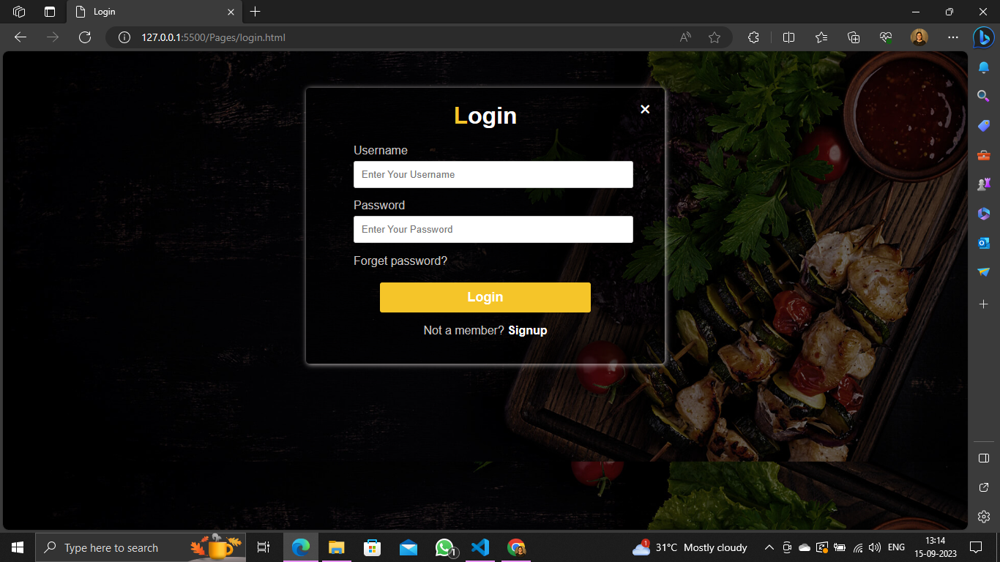
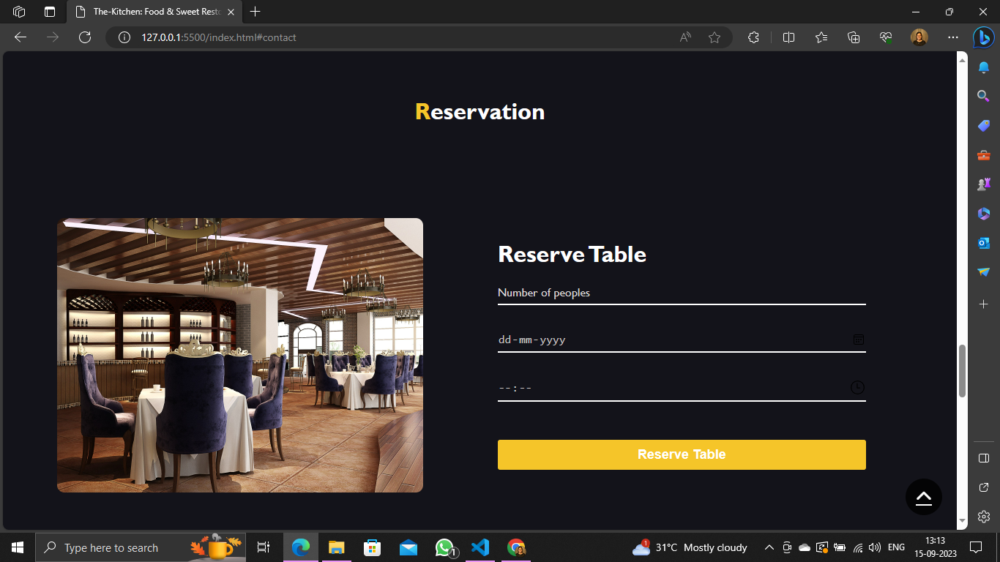

## KARAN MISHRA
**The-Kitchen:** This is my HTML, CSS, JS & JS-DOM base Project for the Restaurant  Reservation System. there are some common pages like Home, Category, Menu, About, Contact, Reservation, Login & Signup. 

#### Our Project live hosted link: https://eduonixjsproject.netlify.app/

## My thoughts about creating the project:
**When I was creating this website I learned more concepts like how to link pages, which property is suitable for any page, and especially Js-Dom concepts and I really enjoyed this project**.

## Landing Page
Welcome to The-Kitchen Restaurant, This is our project landing page including different pages like Menu, Reservation, About, Contact, and Order.

## Login Page
A login page is a fundamental component of most web applications and online services. It serves as the entry point for users to access a secure system by providing their authentication credentials.

## Category Page
The-Kitchen Restaurant provides different types of category foods like Veg, Non-veg, Fast food, and Desserts.

## Menu Page
This Menu page contains different delicious healthy foods in the categories of Veg, Non-veg, Fast food, and Desserts.

## Reservation Page
Our Restaurant provides a reservation facility if you want to reserve our table or book an order, then you can do this at a suitable time or date.

## Contact Page
If you want to visit or reserve a table in our restaurant, contact us here.

